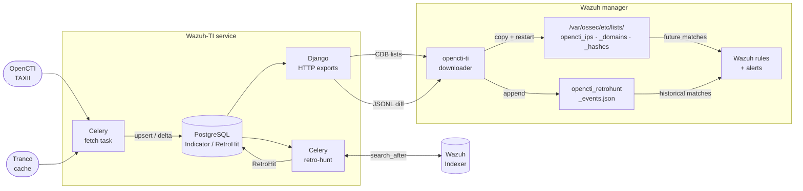

INDEX
- [0. Introduction](#0-introduction)
- [1. Why the OpenCTI path needed a different design](#1-why-the-opencti-path-needed-a-different-design)
- [2. Architecture Overview](#2-architecture-overview)
- [3. Ingestion and IOC Snapshot Management](#3-ingestion-and-ioc-snapshot-management)
- [4. Tranco Filtering and Export Constraints](#4-tranco-filtering-and-export-constraints)
- [5. Retro-Hunting Against Wazuh Indexer](#5-retro-hunting-against-wazuh-indexer)
- [6. Wazuh Manager Integration](#6-wazuh-manager-integration)
- [7. CDB Lists, JSON Events, and Rule Flow](#7-cdb-lists-json-events-and-rule-flow)
- [8. Detection Demo: CobaltStrike C2 from Shodan](#8-detection-demo-cobaltstrike-c2-from-shodan)
  - [Step 1: IOC not in OpenCTI](#step-1-ioc-not-in-opencti)
  - [Step 2: Simulate the beacon communication](#step-2-simulate-the-beacon-communication)
  - [Step 3: Add the IOC to OpenCTI](#step-3-add-the-ioc-to-opencti)
  - [Step 4: Pipeline picks up the new indicators](#step-4-pipeline-picks-up-the-new-indicators)
- [9. Installation](#9-installation)
  - [9.1 Deploy the Django/Celery stack](#91-deploy-the-djangocelery-stack)
  - [9.2 Wazuh manager: rules and ossec.conf](#92-wazuh-manager-rules-and-ossecconf)
  - [9.3 Install the manager downloader](#93-install-the-manager-downloader)
  - [9.4 Cron jobs](#94-cron-jobs)
  - [9.5 Verify](#95-verify)
- [10. Closing Notes](#10-closing-notes)
- [11. Summary](#11-summary)

## 0. Introduction

This project is built using the [Wazuh security platform](https://wazuh.com/?utm_source=ambassadors&utm_medium=referral&utm_campaign=ambassadors+program).

If you are interested in contributing to the community, you can also learn more about the [Wazuh Ambassadors Program](https://wazuh.com/ambassadors-program/?utm_source=ambassadors&utm_medium=referral&utm_campaign=ambassadors+program).

---

In the [previous post]() I described a practical Wazuh threat intelligence pipeline for a homelab: external feeds were downloaded, normalized, deduplicated, written as CDB source lists, and matched by custom Wazuh rules against Sysmon and Suricata telemetry.

That version was intentionally direct. It used the primitives Wazuh already provides: decoded event fields, CDB list lookups, local rules, and scheduled updates. For flat public feeds this approach is still a good fit. The pipeline remains easy to inspect because the output is just text files in the format consumed by Wazuh.

OpenCTI made the old script-based approach awkward. I was no longer just downloading a flat feed and writing three text files. I had to deal with paginated TAXII data, partial fetch failures, local filtering, "new" indicators, retro-hunt jobs, and enough history to understand what happened when a run failed. At that point, keeping everything inside a Wazuh manager cron script felt like the wrong place for the logic.

This post documents the current version of my Wazuh-TI integration. The OpenCTI path is now handled by a small Django/Celery service that fetches indicators from OpenCTI, maintains the current export snapshot, exposes Wazuh-compatible artifacts, and runs retro-hunting queries against the Wazuh Indexer. The Wazuh manager consumes the results through a small unprivileged downloader and a few cron jobs.

I have been running this version in my homelab for about three weeks. It is not a CTI platform and it does not try to be one. It is glue code around a very specific workflow: take usable indicators from OpenCTI, make them consumable by Wazuh, and use the same data to search old alerts.

## 1. Why the OpenCTI path needed a different design

As I described in the [previous post](), Wazuh's native threat intelligence integration is on the roadmap for Wazuh 5.0, but no stable release was available at the time I built this. That meant my homelab was uncovered. I was not willing to wait for a stable release, and I wanted to build something from scratch to understand the problem properly rather than just configure a feature when it eventually shipped.

The first version of Wazuh-TI was a reasonable starting point: download feeds, normalize values, write lists. That model still works well for flat public blocklists.

OpenCTI changes the requirements. The integration has to paginate a TAXII collection, handle partial fetch failures, extract usable values from STIX indicator patterns, filter noise through Tranco, track which values are new since the last run, queue retrohunt work for them, and maintain enough audit history to understand what happened when something goes wrong. That is application state. The right place for it is a dedicated service with a data model and a task queue.

What this adds to Wazuh that is not available natively today:

1. **OpenCTI TAXII ingestion**: Wazuh has no built-in TAXII client. CDB lists must be populated externally; this service handles the full fetch, extraction, and export pipeline automatically.
2. **Retro-hunting against historical alerts**: When a new IOC is imported, Wazuh has no mechanism to check whether past events matched it. This integration queries the Wazuh Indexer over a configurable lookback window and surfaces those historical matches as new alerts.
3. **IOC lifecycle management**: The local indicator snapshot mirrors what OpenCTI currently contains. IOCs removed from OpenCTI are automatically dropped from the next CDB export, preventing stale or retracted indicators from continuing to generate alerts.

## 2. Architecture Overview

The design splits responsibility cleanly: the Django/Celery service owns all ingestion state, and Wazuh remains a pure consumer.



The four HTTP endpoints exported by Django (`opencti_ips`, `opencti_domains`, `opencti_file_hashes` as CDB source lists, and `opencti_retrohunt_events.json` as JSONL evidence) are the only interface the Wazuh manager needs.

On the service side: Django, Gunicorn, Celery, Redis, and PostgreSQL on a single host. On the Wazuh manager side: a downloader script and a handful of cron entries. No sidecars, no message bus.

## 3. Ingestion and IOC Snapshot Management

The ingestion task paginates the TAXII collection and builds a deduplicating in-memory snapshot from the returned STIX indicator objects. For each indicator it tries two paths: read the `observable_values` embedded by OpenCTI in its TAXII extension, then fall back to parsing the raw STIX pattern string. The code handles IPv4/IPv6 addresses, domain names, hostnames, URL host components, and file hashes. Only normalized IOC values are persisted; the richer OpenCTI context stays in OpenCTI.

The local `Indicator` table is a current-state snapshot of whatever OpenCTI contains at the time of each fetch, not a secondary CTI archive. The design is intentional: an IOC that no longer exists in OpenCTI should not keep appearing in Wazuh CDB lists or in retrohunt searches. After each successful fetch the ingestion layer upserts all current values with a fresh `last_seen` timestamp, computes the delta against the previous snapshot, queues `RetroJob` entries for IOC values that are genuinely new, and then deletes any `Indicator` row whose `last_seen` was not refreshed in this run. A value that disappears from OpenCTI (due to retention or manual removal) is gone from the next CDB export. The `RetroHit` evidence records written by past retrohunt runs are never deleted; confirmed historical matches stay on record regardless of subsequent changes to the OpenCTI collection.

*[Image: Django admin: Indicator table showing the current OpenCTI snapshot with kind, value, source, and last_seen fields]*

If a TAXII fetch returns zero indicators, the ingestion layer refuses to replace the current snapshot, treating an empty response as a likely connectivity error rather than a legitimate collection flush.

The first import has dedicated handling. By default the baseline is established without retrohunting the existing collection; only values imported after that point are queued for historical searches. A flag (`retrohunt_queue_existing_on_first_run`) overrides this for deployments that want to retrohunt against an already-populated Wazuh Indexer from day one.

Each ingestion attempt writes a `FetchRun` record: TAXII pages fetched, indicator objects skipped, domains suppressed by the Tranco filter, and new IOC values queued for retrohunting. On failure the error is stored alongside the partial counters, enough to determine whether the cause was a connectivity issue, the zero-indicator guard, or something in the extraction path.

*[Image: Django admin: FetchRun detail with per-run counters and structured log output]*

## 4. Tranco Filtering and Export Constraints

Domain indicators pass through a local Tranco filter before they reach the Wazuh export or the retro-hunt queue. The filter loads the Tranco full-domain CSV into an in-memory suffix set and applies parent-domain suppression: if `example.com` is listed, then `api.cdn.example.com` is filtered too, regardless of whether it appears explicitly. This eliminates the most common class of noisy homelab alerts where legitimate cloud infrastructure or CDN nodes appear in threat feeds.

The Tranco CSV is cached locally and refreshed when it is older than 14 days. If a refresh fails but a stale copy exists, the ingestion continues with the stale data and logs a warning; if no local copy exists at all, the filter step is skipped entirely. Neither failure mode aborts the fetch.

This is a noise filter, not a trust decision. Shared-hosting domains, abused platforms, and fast-flux infrastructure all produce cases where a Tranco-listed domain is genuinely malicious. Those need explicit exceptions or tighter source scoring, not reliance on this filter.

The CDB format has a structural problem with IPv6: Wazuh uses `:` as the key/value separator, which conflicts with the colons in IPv6 address literals. Wazuh handles this by supporting quoted keys, so the export layer wraps IPv6 addresses in double quotes:

```text
"2001:41d0:305:2100::b6d7":opencti
```

IPv4 addresses are exported as plain keys. The manager downloader validates the CDB format before staging any file, applying the same quoting rule: it will reject a file containing a bare IPv6 key before it can corrupt the installed list.

## 5. Retro-Hunting Against Wazuh Indexer

CDB list matching only covers future traffic. If an indicator is imported today, anything that matched it last week is invisible. The retro-hunt queue addresses that gap.

When a new indicator is recorded, a `RetroJob` is queued covering a configurable lookback window (90 days by default). The Celery worker processes these in bounded passes: at most 4 batches per run, up to 250 IPs or domains per batch, with a 2-second delay between Indexer requests. Hashes use a separate smaller batch size of 10, because they require wildcard queries rather than exact terms queries: Sysmon stores all digest algorithms in a single composite text field, so `*<hash>*` wildcards are the only reliable match strategy.

*[Image: Django admin: RetroJob queue showing pending IOC searches with lookback window]*

Results are paginated with `search_after`, sorted by `[timestamp, _id]` to avoid the deep-offset penalty of `from/size`. Without a point-in-time search the result set can shift while documents are being indexed, which is an acceptable trade-off for a homelab workload.

The Indexer query returns candidates; the application re-reads each `_source` to confirm the exact match locally before writing a `RetroHit` row. Every hit records which specific field contained which IOC value, which matters when the same event could match via both `dns.rrname` and `tls.sni`. Along with the matched field name, the application copies agent, rule, location, and decoder metadata from the indexed `_source` into the `RetroHit` row. This context is re-emitted verbatim in the JSONL export, so the Rule 1500 alert that fires downstream carries the full provenance of the original event without requiring a secondary Indexer query.

Confirmed hits are streamed as JSONL from the export endpoint. The manager downloader tracks the last seen event hash and writes only the new tail into the staged file, so root cron can safely append it to the Wazuh-monitored log without replaying the full history.

Each retrohunt pass writes a `RetroHuntRun` record: batches processed, IOCs tested, Indexer hits returned, and how many survived local re-verification. The `pending_after` field shows the remaining queue depth after the run, useful when estimating how long a large initial import will take to drain. The `RetroHit` rows are the durable output: each one identifies the Indexer document, the originating agent, the original Wazuh rule, and the exact matched field, without requiring a follow-up Indexer query.

## 6. Wazuh Manager Integration

On the Wazuh manager I use a dedicated unprivileged user:

```text
opencti-ti
```

The downloader runs as this user and writes only to:

```text
/home/opencti-ti/iocs/
```

It does not write to `/var/ossec`, does not change ownership to `wazuh`, and does not restart the manager. Those operations are left to root cron jobs.

The `opencti-ti` cron refreshes the staged files hourly:

```cron
SHELL=/bin/bash
PATH=/usr/local/sbin:/usr/local/bin:/usr/sbin:/usr/bin:/sbin:/bin

10 * * * * /home/opencti-ti/bin/fetch-opencti-lists-from-django.py >> /home/opencti-ti/logs/fetch-opencti-lists-from-django.log 2>&1
```

Root installs the staged CDB source lists into Wazuh twice per day:

```cron
# Copy OpenCTI CDB lists into Wazuh and restart the manager to reload CDB lists.
5 23,6 * * * cp /home/opencti-ti/iocs/opencti_ips /home/opencti-ti/iocs/opencti_domains /home/opencti-ti/iocs/opencti_file_hashes /var/ossec/etc/lists/ && chown wazuh:wazuh /var/ossec/etc/lists/opencti_ips /var/ossec/etc/lists/opencti_domains /var/ossec/etc/lists/opencti_file_hashes && chmod 640 /var/ossec/etc/lists/opencti_ips /var/ossec/etc/lists/opencti_domains /var/ossec/etc/lists/opencti_file_hashes

15 23,6 * * * systemctl restart wazuh-manager >> /var/log/wazuh-restart.log 2>&1
```

The restart is deliberate: CDB source lists are compiled and loaded by the manager during startup.

*[Image: Wazuh manager: compiled CDB files for OpenCTI indicators after manager restart]*

New retro-hunt events are appended hourly to a JSON log monitored by Wazuh:

```cron
# Append retro-hunt JSON events into the Wazuh log path, without restarting Wazuh.
20 * * * * test -s /home/opencti-ti/iocs/opencti_retrohunt_events.json && cat /home/opencti-ti/iocs/opencti_retrohunt_events.json >> /var/ossec/logs/opencti_retrohunt_events.json && chown wazuh:wazuh /var/ossec/logs/opencti_retrohunt_events.json && chmod 640 /var/ossec/logs/opencti_retrohunt_events.json
```

The important detail here is deduplication. The Django endpoint streams the stored `RetroHit` records, while the manager downloader keeps a local last-event hash and writes only the new tail of the export into the staged JSONL file. Root cron appends that staged diff to the monitored Wazuh log.

Unlike CDB list updates, this path does not need a manager restart. Wazuh reads the file as a JSON `localfile`, so appending new JSONL events is enough. The only thing to avoid is replaying the full export every hour, because that would create duplicate evidence events and probably duplicate alerts.

## 7. CDB Lists, JSON Events, and Rule Flow

The OpenCTI CDB lists must be registered inside the `<ruleset>` block of `/var/ossec/etc/ossec.conf`:

```xml
<list>etc/lists/opencti_ips</list>
<list>etc/lists/opencti_domains</list>
<list>etc/lists/opencti_file_hashes</list>
```

The provided local rules then match the decoded Suricata and Sysmon fields I care about against those lists: Suricata IP, DNS, TLS SNI and HTTP hostname fields on Linux, and Sysmon network, DNS and hash-related fields on Windows.

Retro-hunt hits are not list entries. They are generated evidence events. A typical exported event looks like:

```json
{"retrohunt":{"source":"opencti","match_type":"historical_ioc_match","kind":"ip","value":"1.2.3.4","historical":{"index":"wazuh-alerts-*","document_id":"example","timestamp":"2026-06-13T10:00:00Z"}}}
```

Wazuh ingests the file with a JSON `localfile` and a rule matches:

```xml
<field name="retrohunt.source">^opencti$</field>
<field name="retrohunt.match_type">^historical_ioc_match$</field>
```

This creates two distinct detection paths:

```text
CDB lists        -> future telemetry matches
Retro-hunt JSON  -> historical telemetry matches
```

Both produce Wazuh alerts, but they are intentionally separate workflows.

## 8. Detection Demo: CobaltStrike C2 from Shodan

To illustrate the full pipeline in operation, here is a real scenario from my homelab: a CobaltStrike C2 server found on Shodan that was not yet in my OpenCTI instance.

### Step 1: IOC not in OpenCTI

Shodan listed `139.196.34.57` as a CobaltStrike C2 host. The extracted beacon configuration identified `43.139.221.182` as the actual C2 endpoint:

```text
BeaconType  : HTTP
Port        : 3369
C2Server    : 43.139.221.182,/__utm.gif
UserAgent   : Mozilla/5.0 (compatible; MSIE 9.0; Windows NT 6.0; Trident/5.0; BOIE9;ENUSMSNIP)
HttpPostUri : /submit.php
```

A search in OpenCTI confirmed neither IP was present in the local instance at the time.

*[Image: Neither IOC is in OpenCTI]*

### Step 2: Simulate the beacon communication

To generate network telemetry *before* adding the IOC to OpenCTI, I replayed the beacon check-in using `curl` with the exact User-Agent and URI from the extracted configuration:

```bash
curl -A "Mozilla/5.0 (compatible; MSIE 9.0; Windows NT 6.0; Trident/5.0; BOIE9;ENUSMSNIP)" \
     -H "Cookie: " \
     http://43.139.221.182/__utm.gif
```

The host responded with what appears to be a repurposed server. The original C2 infrastructure no longer serves beacon responses, but the connection produced Suricata telemetry captured by Wazuh. At this stage the event was matched only by a generic Suricata rule at level 3. The IP was not yet in the CDB list, so no TI rule fired.

*[Image: Suricata alert for the simulated beacon connection: generic rule, no TI hit yet]*

### Step 3: Add the IOC to OpenCTI

`43.139.221.182` was added with the `CobaltStrike` label and `139.196.34.57` with `CobaltStrike Beacon`, both sourced from Shodan.

*[Image: Both IOCs added to OpenCTI as Shodan indicators]*

### Step 4: Pipeline picks up the new indicators

The next Celery fetch pulls the new indicators from the OpenCTI TAXII collection. Once ingested into the local `Indicator` snapshot, they appear in the next CDB list export. The root cron job copies the updated `opencti_ips` list to `/var/ossec/etc/lists/` and restarts the Wazuh manager to recompile it.

From that point forward:

- Any new Suricata event with `dest_ip` matching either address fires rule `1450` at level 16; `src_ip` matches fire rule `1451` at level 16.
- The retrohunt queue receives a `RetroJob` for both IPs. On the next run, the Celery worker searches the Wazuh Indexer for historical events matching these addresses, including the simulated beacon connection from step 2, which is already indexed. Confirmed matches are exported as retro-hunt evidence events, triggering rule `1500`.

The key detail is the timeline: the simulated connection happened *before* the IOC was known to the system. The retrohunt is exactly the mechanism that surfaces that gap.

The scheduled TAXII fetch ran at 3:00 AM. By 6:20 AM, the Discord integration (described in the [alerting section](#6-alerting) of the previous post) had delivered two notifications: one per matched historical event.

*[Image: Discord: two Rule 1500 retro-hunt alerts at 6:20 AM]*

Working backwards: the `FetchRun` record in the Django admin shows **665 new IOC values** queued as `RetroJob` entries, the two CobaltStrike addresses among them.

*[Image: Django admin fetch run: 665 new IOCs queued as retro-hunting jobs]*

Both indicators are now present in the local `Indicator` table and included in the `opencti_ips` export. Searching the admin for each address confirms the exact ingestion time: `139.196.34.57` and `43.139.221.182` were first recorded at 3:03 and 3:04 AM respectively, with the CDB export line already populated.

*[Image: Both CobaltStrike IPs present in the Wazuh-TI indicator snapshot]*

The Celery worker's next retrohunt run queried the Wazuh Indexer over the 90-day lookback window and returned **2 confirmed hits**.

*[Image: Retro hunt runs: the 6:00 AM run shows 2 hits across 112 IOCs tested]*

Both hits reference `43.139.221.182`, but each comes from a different Suricata event generated by the same `curl` in step 2. The HTTP event (`Suricata HTTP Traffic.`) matched via `data.dest_ip`: the CobaltStrike server was the outbound connection target. The `fileinfo` event produced by the same TCP flow matched via `data.src_ip`: in Suricata's fileinfo records, the file-serving host appears as the source. Two distinct Wazuh Indexer documents, same IOC, different event types.

*[Image: Two RetroHit rows in Wazuh-TI: same IP, matched via data.dest_ip and data.src_ip respectively]*

Both Rule 1500 alerts are visible in Wazuh Discover, timestamped hours after the original connection.

*[Image: Wazuh Discover: two Rule 1500 retro-hunt alerts]*

The `data.retrohunt` field in each alert carries the full event provenance:

```json
{
  "timestamp": "2026-06-18T04:20:01Z",
  "rule": {
    "id": "1500",
    "level": 16,
    "description": "TI retro-hunt hit: historical event matches newly imported OpenCTI IOC"
  },
  "data": {
    "retrohunt": {
      "source": "opencti",
      "match_type": "historical_ioc_match",
      "kind": "ip",
      "value": "43.139.221.182",
      "historical": {
        "index": "wazuh-alerts-4.x-2026.06.17",
        "timestamp": "2026-06-17T19:54:59Z",
        "matched_fields": "data.dest_ip",
        "agent": {
          "name": "fede_pc_thinkpad"
        },
        "rule": {
          "id": "100006",
          "level": 3,
          "description": "Suricata HTTP Traffic."
        },
        "location": "/var/log/suricata/eve.json"
      }
    }
  }
}
```

The `historical.matched_fields` key and the preserved rule metadata are produced by the local re-verification step described in [§5](#5-retro-hunting-against-wazuh-indexer): the application reads the `_source` of each Indexer candidate, confirms which exact field contains the IOC value, and copies the original event context into the `RetroHit` row before it is exported.

## 9. Installation

The repository with all files, rules, and the full installation reference is at:

**[https://github.com/federicofantini/Wazuh-TI](https://github.com/federicofantini/Wazuh-TI)**

The steps below are a condensed reference. The README contains additional detail, edge cases, and troubleshooting notes.

### 9.1 Deploy the Django/Celery stack

Clone the repository and copy the environment template:

```bash
git clone https://github.com/federicofantini/Wazuh-TI.git
cd Wazuh-TI
cp docker/.env.example docker/.env
```

Edit `docker/.env` and set at minimum:

```text
DJANGO_SECRET_KEY=<openssl rand -hex 32>
DJANGO_ALLOWED_HOSTS=localhost,127.0.0.1,wazuh-ti.example.internal
DJANGO_CSRF_TRUSTED_ORIGINS=https://wazuh-ti.example.internal
POSTGRES_PASSWORD=<strong password>
DATABASE_URL=postgresql://wazuh_ti:<same password>@postgres:5432/wazuh_ti
DJANGO_SUPERUSER_PASSWORD=<admin password>
WAZUH_TI_EXPORT_API_TOKEN=<random token>
WAZUH_TI_TAXII_URL=https://opencti.example/api/taxii2/root/collections/<id>/objects/
WAZUH_TI_WAZUH_INDEXER_URL=https://wazuh-indexer.example:9200
WAZUH_TI_WAZUH_INDEXER_USERNAME=<indexer user>
WAZUH_TI_WAZUH_INDEXER_PASSWORD=<indexer password>
```

Start the stack:

```bash
docker compose -f docker/docker-compose.local.yml up -d --build
```

The `web` container runs migrations, bootstraps the `TiConfiguration` singleton if absent, and creates the first superuser. Open `http://localhost:8000/admin/` and verify the TI configuration under **TI configuration → Wazuh-TI configuration**.

### 9.2 Wazuh manager: rules and ossec.conf

Copy the provided rule files onto the Wazuh manager:

```bash
sudo cp wazuh-manager/var/ossec/etc/rules/local_ti_rules_opencti_linux.xml /var/ossec/etc/rules/
sudo cp wazuh-manager/var/ossec/etc/rules/local_ti_rules_opencti_windows.xml /var/ossec/etc/rules/
sudo cp wazuh-manager/var/ossec/etc/rules/local_ti_rules_retrohunt.xml      /var/ossec/etc/rules/
sudo chown wazuh:wazuh /var/ossec/etc/rules/local_ti_rules_*.xml
```

Register the CDB lists and the retro-hunt `localfile` in `/var/ossec/etc/ossec.conf`:

```xml
<!-- inside <ruleset> -->
<list>etc/lists/opencti_ips</list>
<list>etc/lists/opencti_domains</list>
<list>etc/lists/opencti_file_hashes</list>

<!-- inside <ossec_config> -->
<localfile>
  <location>/var/ossec/logs/opencti_retrohunt_events.json</location>
  <log_format>json</log_format>
</localfile>
```

Create the retro-hunt log file and restart the manager:

```bash
sudo touch /var/ossec/logs/opencti_retrohunt_events.json
sudo chown wazuh:wazuh /var/ossec/logs/opencti_retrohunt_events.json
sudo chmod 640 /var/ossec/logs/opencti_retrohunt_events.json
sudo systemctl restart wazuh-manager
```

### 9.3 Install the manager downloader

Create the dedicated unprivileged user and deploy the downloader:

```bash
sudo adduser --disabled-password --gecos "" opencti-ti
sudo -u opencti-ti mkdir -p /home/opencti-ti/{bin,iocs,logs}

sudo cp wazuh-manager/usr/local/bin/fetch-opencti-lists-from-django.py \
  /home/opencti-ti/bin/fetch-opencti-lists-from-django.py
sudo chown opencti-ti:opencti-ti /home/opencti-ti/bin/fetch-opencti-lists-from-django.py
sudo chmod 750 /home/opencti-ti/bin/fetch-opencti-lists-from-django.py
```

Edit the constants at the top of the script:

```python
WAZUH_TI_BASE_URL = "https://wazuh-ti.example.internal"
WAZUH_TI_TOKEN    = "<export_api_token from Django Admin>"
INSECURE_TLS      = False
```

Test it:

```bash
sudo -u opencti-ti /home/opencti-ti/bin/fetch-opencti-lists-from-django.py
sudo -u opencti-ti ls -lh /home/opencti-ti/iocs/
```

### 9.4 Cron jobs

`opencti-ti` crontab: refresh exported artifacts hourly:

```cron
SHELL=/bin/bash
PATH=/usr/local/sbin:/usr/local/bin:/usr/sbin:/usr/bin:/sbin:/bin

10 * * * * /home/opencti-ti/bin/fetch-opencti-lists-from-django.py >> /home/opencti-ti/logs/fetch-opencti-lists-from-django.log 2>&1
```

Root crontab: install CDB lists and restart Wazuh twice daily; append retro-hunt events hourly:

```cron
# Copy CDB lists and restart Wazuh to recompile them.
5 23,6 * * * cp /home/opencti-ti/iocs/opencti_ips /home/opencti-ti/iocs/opencti_domains /home/opencti-ti/iocs/opencti_file_hashes /var/ossec/etc/lists/ && chown wazuh:wazuh /var/ossec/etc/lists/opencti_ips /var/ossec/etc/lists/opencti_domains /var/ossec/etc/lists/opencti_file_hashes && chmod 640 /var/ossec/etc/lists/opencti_ips /var/ossec/etc/lists/opencti_domains /var/ossec/etc/lists/opencti_file_hashes
15 23,6 * * * systemctl restart wazuh-manager >> /var/log/wazuh-restart.log 2>&1

# Append new retro-hunt events (no restart needed).
20 * * * * test -s /home/opencti-ti/iocs/opencti_retrohunt_events.json && cat /home/opencti-ti/iocs/opencti_retrohunt_events.json >> /var/ossec/logs/opencti_retrohunt_events.json && chown wazuh:wazuh /var/ossec/logs/opencti_retrohunt_events.json && chmod 640 /var/ossec/logs/opencti_retrohunt_events.json
```

### 9.5 Verify

Check that the manager compiled the CDB lists after the restart:

```bash
sudo ls -lh /var/ossec/etc/lists/opencti_*.cdb
```

Test the retro-hunt rule with `wazuh-logtest`:

```bash
sudo /var/ossec/bin/wazuh-logtest
```

Paste this event and confirm rule `1500` fires at level 16:

```json
{"retrohunt":{"source":"opencti","match_type":"historical_ioc_match","kind":"ip","value":"198.51.100.1","historical":{"index":"wazuh-alerts-test","document_id":"test-1","timestamp":"2026-06-13T10:00:00Z"}}}
```

## 10. Closing Notes

This is the current shape of my Wazuh-TI integration.

The project started as a feed updater script and slowly became a small OpenCTI-to-Wazuh service. The main difference is that it now has state: I can see fetches, exports, queued retro-hunts, failed searches and historical hits without guessing from cron logs. I have been using it in my homelab for about three weeks, and the current version is complete enough to be reproducible.

There is still room for improvement: the downloader could be packaged more cleanly, the manager-side install step could be made more atomic, and the Wazuh rule set can be expanded with more environment-specific telemetry. For my current scope, that is enough. OpenCTI stays the source of CTI context, the Django service turns selected indicators into Wazuh-friendly artifacts, and the Wazuh manager stays focused on detection.

The repository contains the setup guide and the files used in my deployment. Contributions, issues and pull requests are welcome.

## 11. Summary

<div class="markmap"><script type="text/template">
# Wazuh-TI + OpenCTI
## Ingestion
### OpenCTI TAXII collection
### STIX extraction (observables + patterns)
### IPv4 / IPv6 / domains / hashes
### Zero-indicator safety guard
### First-run baseline flag
## Filtering
### Tranco full-domain filter
### Parent-domain suffix suppression
### IPv6 quoted CDB keys
## State
### Indicator (current snapshot)
### FetchRun (ingestion audit)
### RetroJob (transient work queue)
### RetroHuntRun (query pass metadata)
### RetroHit (confirmed evidence, never deleted)
## Export endpoints
### /opencti_ips
### /opencti_domains
### /opencti_file_hashes
### /opencti_retrohunt_events.json
## Wazuh manager
### opencti-ti (unprivileged downloader)
### CDB lists → /var/ossec/etc/lists/
### Root cron: copy + manager restart (2×/day)
### Root cron: JSONL append (hourly, no restart)
## Detection
### Future: CDB match → rules 1400-1454
### Historical: retrohunt JSONL → rule 1500
### Suricata: IP / DNS / TLS SNI / HTTP host
### Sysmon: network / DNS / file hashes (wildcard)
## Retro-Hunting
### New IOC → RetroJob queued automatically
### search_after pagination (no deep-offset penalty)
### Local re-verification before writing RetroHit
### JSONL delta export (last-event hash dedup)
</script></div>
