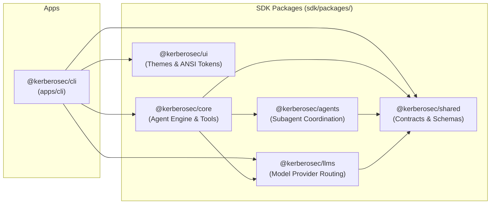
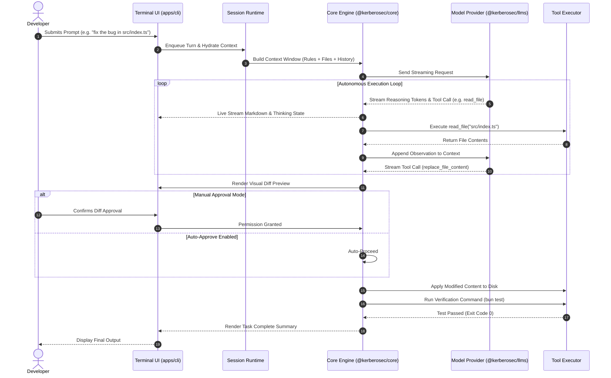
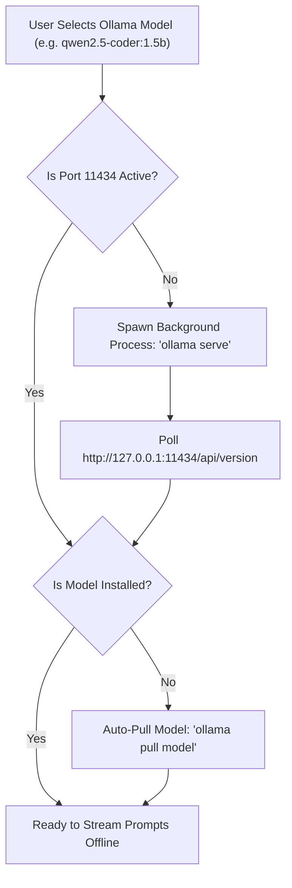

<p align="center">
  
</p>

<h1 align="center">KerberoSec CLI</h1>

<p align="center">
  <strong>Next-Generation Autonomous Agentic AI Coding Assistant for your Terminal</strong>
  <br>
  Architected, developed, and maintained by <a href="https://github.com/KerberoSec"><strong>Arun Kumar</strong></a>
</p>

<p align="center">
  <a href="https://github.com/KerberoSec/KerberoSec-CLI/blob/main/LICENSE"></a>
  <a href="https://bun.sh"></a>
  <a href="https://www.typescriptlang.org"></a>
  <a href="https://ollama.com"></a>
</p>

<div align="center">
  <table>
    <tbody>
      <tr>
        <td align="center"><a href="https://www.linkedin.com/in/arunkumar31072006/" target="_blank"><strong>💼 LinkedIn</strong></a></td>
        <td align="center"><a href="https://github.com/KerberoSec" target="_blank"><strong>🐙 GitHub</strong></a></td>
        <td align="center"><a href="https://x.com/ArunKumar310706" target="_blank"><strong>🐦 X (Twitter)</strong></a></td>
        <td align="center"><a href="https://www.instagram.com/so_far_from_your_heart/" target="_blank"><strong>📷 Instagram</strong></a></td>
        <td align="center"><a href="./Setup.md"><strong>📖 Setup Guide</strong></a></td>
      </tr>
    </tbody>
  </table>
</div>

---

## 🌟 Table of Contents
1. [Overview](#-overview)
2. [Key Features](#-key-features)
3. [Complete Architecture Deep Dive](#-complete-architecture-deep-dive)
   - [Monorepo Package Layout](#monorepo-package-layout)
   - [Subsystem 1: Terminal Presentation and UI Engine](#subsystem-1-terminal-presentation-and-ui-engine-appsclisrctui)
   - [Subsystem 2: Interactive Session Runtime](#subsystem-2-interactive-session-runtime-appsclisrcruntime)
   - [Subsystem 3: Core Agent Execution Engine](#subsystem-3-core-agent-execution-engine-kerberoseccore)
   - [Subsystem 4: Model and Provider Routing Layer](#subsystem-4-model-and-provider-routing-layer-kerberosecllms)
   - [Subsystem 5: Tool Execution, MCP and Subagents](#subsystem-5-tool-execution-mcp-and-subagents-kerberosecagents)
4. [Step-by-Step Execution Pipeline](#-step-by-step-execution-pipeline)
5. [Ollama Local AI Auto-Daemon Lifecycle](#-ollama-local-ai-auto-daemon-lifecycle)
6. [Quick Start and Automated Installation](#-quick-start-and-automated-installation)
7. [Commands and Shortcuts Reference](#-commands-and-shortcuts-reference)
8. [Author and License](#-author-and-license)

---

## 🌟 Overview

**KerberoSec CLI** is a production-grade, terminal-native autonomous AI coding assistant. It inspects entire codebases, designs technical architectures, modifies code with granular diffs, executes terminal commands, performs semantic ripgrep searches, coordinates subagents, and integrates with Model Context Protocol (MCP) servers.

Built on top of a reactive virtual DOM engine (**OpenTUI & React 19**), KerberoSec CLI combines the responsiveness of modern terminal applications with deep agentic reasoning loops powered by both local offline models (Ollama) and cloud APIs.

---

## 🚀 Key Features

- 🤖 **Offline Local AI with Automatic Daemon Management**:
  - Full first-class support for open-weights models (`qwen2.5-coder:1.5b`, `qwen2.5-coder:7b`, `llama3`, `deepseek-coder`).
  - **Zero-Config Daemon Startup**: Automatically checks for an active Ollama server on port `11434` and launches `ollama serve` in the background when an Ollama model is selected.
- ☁️ **Cloud AI Providers**:
  - Seamless integration with Anthropic (Claude 3.7 Sonnet / Opus), OpenAI (GPT-4o), Google Gemini (2.0 Flash/Pro), Groq, DeepSeek, and OpenRouter.
- ⚡ **Dual Plan vs. Act Execution Modes**:
  - **Plan Mode**: Constrains the model to read-only tools to safely investigate code, evaluate trade-offs, and draft step-by-step implementation plans without touching disk files.
  - **Act Mode**: Unlocks write tools, executes file edits, applies diffs, and runs automated verification commands.
  - Switch between modes instantly using <kbd>Tab</kbd>.
- 🔐 **Account Management & Clean `/logout`**:
  - Reset cached auth tokens, switch profiles, and transition cleanly back to the onboarding login view with `/logout`.
- ⌨️ **Ergonomic Terminal Keyboard Navigation**:
  - **Single <kbd>Ctrl</kbd>+<kbd>C</kbd>**: Preserved for standard terminal text copying without interrupting active thinking streams.
  - **Double <kbd>Ctrl</kbd>+<kbd>C</kbd>**: Exits the application cleanly when pressed twice within 2 seconds.
  - **<kbd>Esc</kbd>**: Cancels active reasoning or long-running turn executions.
  - **<kbd>Ctrl</kbd>+<kbd>P</kbd>**: Opens the fuzzy Command Palette.
- 🔌 **Extensible Model Context Protocol (MCP)**:
  - Connect external MCP servers over stdio or HTTP SSE to equip the agent with custom APIs, database connections, and specialized tools.
- 📦 **1-Step Automated Installer**:
  - Automated `./setup.sh` installer detects the operating system, installs Bun and Ollama, compiles all monorepo packages, and configures global CLI access.

---

## 🏛️ Complete Architecture Deep Dive

KerberoSec CLI is built using a clean, layered architecture where responsibilities are separated into distinct packages across the monorepo:

### Monorepo Package Layout

```text
KerberoSec-CLI/
├── apps/
│   └── cli/                      # Interactive Terminal User Interface application
│       ├── src/
│       │   ├── commands/         # Subcommand dispatchers (config, auth, mcp, doctor)
│       │   ├── runtime/          # Session state machine, turn loop, compaction
│       │   ├── tui/              # OpenTUI React components, views, hooks, themes
│       │   │   ├── hooks/        # useRootKeyboard, useAutocomplete, useSlashCommands
│       │   │   ├── views/        # ChatView, OnboardingView, ConfigView, HistoryView
│       │   │   └── components/   # Chat bubbles, diff viewers, status bar, modals
│       │   └── utils/            # Ollama manager, clipboard, token counters
│       └── bun.mts               # Production bundler for single executable
├── sdk/
│   └── packages/
│       ├── core/                 # Tool registry, file system mutations, checkpoints
│       ├── llms/                 # Provider adapters (Ollama, Claude, OpenAI, Gemini)
│       ├── agents/               # Subagent orchestration and coordination protocols
│       ├── shared/               # TypeScript schemas, contracts, and protocol buffers
│       └── ui/                   # ANSI theme contracts, color tokens, and layout utils
├── Setup.md                      # Manual setup guide for fresh machines
└── setup.sh                      # 1-step automated system installer
```



---

### Subsystem 1: Terminal Presentation and UI Engine (`apps/cli/src/tui`)

The presentation layer utilizes **OpenTUI** integrated with React 19 to render interactive terminal interfaces without flickering.

1. **Virtual DOM Diffing in Terminal ANSI Space**:
   - Terminal cells are represented as an in-memory grid. On state changes, OpenTUI calculates the minimal ANSI escape sequence diffs to update changed characters, ensuring sub-millisecond refresh rates.
2. **Keyboard Dispatch Engine ([`use-root-keyboard.ts`](file:///home/Kali/Desktop/CLI/KerberoSec-CLI/apps/cli/src/tui/hooks/use-root-keyboard.ts))**:
   - Listens to raw key input events.
   - Double <kbd>Ctrl</kbd>+<kbd>C</kbd> timing window: Tracks timestamps across consecutive presses to differentiate between copying text and requesting application termination.
   - Mode switching: Routes <kbd>Tab</kbd> events to toggle execution states in the session context.
3. **Views & Dialog Layer**:
   - **`ChatView`**: Renders message bubbles, streaming typewriter markdown, tool call summaries, and unified diff syntax highlighters.
   - **`OnboardingView`**: Displays responsive, full-screen login provider selection and API configuration wizards.
   - **`ConfigView`**: Model parameter tuning (temperature, reasoning effort, context limits).

---

### Subsystem 2: Interactive Session Runtime (`apps/cli/src/runtime`)

The session runtime manages the state machine for ongoing coding conversations:

1. **Prompt Ingestion and Queue**:
   - When users submit prompts while an agent task is active, prompts are queued into a sequential turn buffer rather than dropped.
2. **Message Hydration and Token Budgeting**:
   - Assembles system instructions, active workspace rules (`.kerberosecrules/`), loaded skills (`.kerberosec/`), and conversation history.
   - **Compaction Coordinator**: Calculates remaining token headroom in the model's context window. If the limit is approached, previous turns are intelligently condensed into a summary checkpoint.
3. **Stream Transformer**:
   - Ingests chunked tokens from the LLM provider, separates internal thought streams (`<thinking>`) from visible responses, and detects structured tool invocations.

---

### Subsystem 3: Core Agent Execution Engine (`@kerberosec/core`)

The brain of KerberoSec CLI that orchestrates autonomous coding tasks:

1. **ReAct Reasoning and Planning Loop**:
   - The agent operates in a continuous loop: **Reason &rarr; Plan Tool &rarr; Execute Tool &rarr; Observe Output &rarr; Decide Next Action**.
2. **Checkpoint and Rollback Engine**:
   - Before executing any file edits, the engine snapshots affected files. If a modification produces syntax errors or the user aborts, changes can be rolled back immediately.
3. **Security Permission Gate**:
   - **Safe Reads**: `read_file`, `list_dir`, `find_by_name`, `grep_search` execute without prompting.
   - **File Writes / Edits**: `replace_file_content` and `write_to_file` produce interactive diff previews for human-in-the-loop review (unless auto-approve is toggled with <kbd>Shift</kbd>+<kbd>Tab</kbd>).
   - **Command Execution**: `run_command` requires user approval and streams subprocess output in real time.

---

### Subsystem 4: Model and Provider Routing Layer (`@kerberosec/llms`)

Standardizes prompt delivery and response streaming across local and cloud backends:

1. **Unified Provider Abstraction**:
   - Translates generic chat messages and tool specifications into provider-specific payloads (Ollama JSON, OpenAI format, Anthropic Messages API, Google GenAI SDK).
2. **Offline Ollama Engine**:
   - Direct HTTP keep-alive communication with the local Ollama API.
   - Automatic streaming token decompression and parameter configuration (context length, temperature).

---

### Subsystem 5: Tool Execution, MCP and Subagents (`@kerberosec/agents`)

Provides the agent with its interactive superpowers:

1. **File System Operations**:
   - Exact substring match and replacement algorithm (`replace_file_content`) to prevent accidental overwrites.
2. **Process Management**:
   - Runs background or foreground shell commands with pseudo-terminal (PTY) support and configurable timeouts.
3. **Model Context Protocol (MCP) Client**:
   - Dynamic JSON-RPC client capable of establishing stdio or SSE connections with MCP servers to discover and invoke custom tools.
4. **Concurrent Subagents**:
   - Spawns isolated worker agents for complex research tasks without polluting the main conversation context.

---

## 🔄 Step-by-Step Execution Pipeline

The following diagram illustrates the complete end-to-end data flow when a user prompt is processed:



---

## 🤖 Ollama Local AI Auto-Daemon Lifecycle

KerberoSec CLI ensures that local models work out of the box without requiring manual server startup:



---

## ⚡ Quick Start and Automated Installation

### Method 1: Automated 1-Step Setup (Recommended)

```bash
git clone https://github.com/KerberoSec/KerberoSec-CLI.git
cd KerberoSec-CLI

chmod +x setup.sh
./setup.sh
```

The installer script automatically:
1. Installs system packages (`git`, `curl`, `build-essential`).
2. Installs and configures the **Bun** runtime.
3. Installs and configures **Ollama** with recommended coding models.
4. Installs monorepo dependencies and compiles the SDK and CLI bundle.
5. Configures the global `kerberosec` executable in your `$PATH`.

---

### Method 2: Manual Installation

```bash
# 1. Install Bun
curl -fsSL https://bun.sh/install | bash
source ~/.bashrc # or source ~/.zshrc

# 2. Clone repository & install packages
git clone https://github.com/KerberoSec/KerberoSec-CLI.git
cd KerberoSec-CLI
bun install

# 3. Build SDK and CLI
bun run build:sdk
bun -F @kerberosec/cli build

# 4. Link global command
mkdir -p ~/.local/bin
cat << 'EOF' > ~/.local/bin/kerberosec
#!/usr/bin/env bash
export PATH="$HOME/.bun/bin:$PATH"
exec bun run /FULL_PATH_TO/KerberoSec-CLI/apps/cli/src/index.ts "$@"
EOF
chmod +x ~/.local/bin/kerberosec
export PATH="$HOME/.local/bin:$PATH"
```

---

## ⌨️ Commands and Shortcuts Reference

### Slash Commands
| Command | Description |
| :--- | :--- |
| **`/logout`** | Sign out of the active account and return to login onboarding |
| **`/model`** | Open the model selector to switch between local Ollama and cloud providers |
| **`/mcp`** | Manage Model Context Protocol (MCP) servers and tools |
| **`/clear`** | Reset conversation history and start a fresh session |
| **`/help`** | Open the interactive help and documentation dialog |

### Keyboard Shortcuts
| Shortcut | Action |
| :--- | :--- |
| **<kbd>Tab</kbd>** | Toggle between **Plan** and **Act** modes |
| **<kbd>Ctrl</kbd>+<kbd>P</kbd>** | Open the Command Palette |
| **<kbd>Ctrl</kbd>+<kbd>C</kbd> (1x)** | Copy selected text / active input (never halts thinking) |
| **<kbd>Ctrl</kbd>+<kbd>C</kbd> (2x)** | Cleanly exit KerberoSec CLI |
| **<kbd>Esc</kbd>** | Cancel ongoing thinking or prompt execution |
| **<kbd>Shift</kbd>+<kbd>Tab</kbd>** | Toggle auto-approval mode for tool executions |

---

## 👤 Author and Maintainer

**Arun Kumar**
- 💼 **LinkedIn**: [arunkumar31072006](https://www.linkedin.com/in/arunkumar31072006/)
- 🐙 **GitHub**: [@KerberoSec](https://github.com/KerberoSec)
- 🐦 **X / Twitter**: [@ArunKumar310706](https://x.com/ArunKumar310706)
- 📷 **Instagram**: [@so_far_from_your_heart](https://www.instagram.com/so_far_from_your_heart/)

---

## 📄 License

This project is licensed under the **Apache 2.0 License** - see the [`LICENSE`](./LICENSE) file for details.

Copyright © 2026 **Arun Kumar (KerberoSec)**. All rights reserved.
