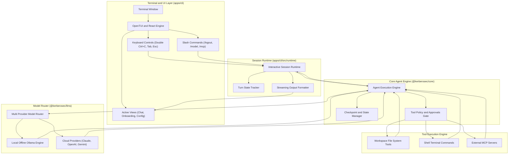

<p align="center">
  
</p>

<h1 align="center">KerberoSec CLI</h1>

<p align="center">
  <strong>Next-Generation Autonomous Agentic AI Coding Assistant for your Terminal</strong>
  <br>
  Designed, developed, and maintained by <a href="https://github.com/KerberoSec"><strong>Arun Kumar</strong></a>
</p>

<p align="center">
  <a href="https://github.com/KerberoSec/KerberoSec-CLI/blob/main/LICENSE"></a>
  <a href="https://bun.sh"></a>
  <a href="https://www.typescriptlang.org"></a>
  <a href="https://ollama.com"></a>
</p>

<div align="center">
  <table>
    <tbody>
      <tr>
        <td align="center"><a href="https://www.linkedin.com/in/arunkumar31072006/" target="_blank"><strong>💼 LinkedIn</strong></a></td>
        <td align="center"><a href="https://github.com/KerberoSec" target="_blank"><strong>🐙 GitHub</strong></a></td>
        <td align="center"><a href="https://x.com/ArunKumar310706" target="_blank"><strong>🐦 X (Twitter)</strong></a></td>
        <td align="center"><a href="https://www.instagram.com/so_far_from_your_heart/" target="_blank"><strong>📷 Instagram</strong></a></td>
        <td align="center"><a href="./Setup.md"><strong>📖 Setup Guide</strong></a></td>
      </tr>
    </tbody>
  </table>
</div>

---

## 🌟 Overview

**KerberoSec CLI** is a terminal-based autonomous AI coding agent capable of inspecting codebases, planning architectures, editing files, executing terminal commands, running diagnostics, and orchestrating Model Context Protocol (MCP) servers.

Built with a modern reactive Terminal User Interface (TUI) powered by **OpenTUI & React**, KerberoSec CLI combines the speed of terminal workflows with the reasoning power of local and cloud AI models.

---

## 🚀 Key Features

- 🤖 **Local & Offline AI (Ollama First-Class Support)**:
  - Full support for local models like `qwen2.5-coder:1.5b`, `qwen2.5-coder:7b`, `llama3`, and `deepseek-coder`.
  - **Auto-Daemon Management**: Automatically checks and runs `ollama serve` in the background when an Ollama model is selected.
- ☁️ **Cloud AI Providers**:
  - Seamless integration with OpenAI (GPT-4o), Anthropic (Claude 3.7 Sonnet / Opus), Google Gemini, Groq, DeepSeek, and OpenRouter.
- ⚡ **Dual Execution Modes (Plan vs. Act)**:
  - **Plan Mode**: Focuses on analyzing requirements, reviewing architecture, and drafting step-by-step implementation roadmaps without modifying files.
  - **Act Mode**: Autonomously executes changes, creates/modifies files, and runs verification commands with live diff previews.
  - Switch instantly between modes using <kbd>Tab</kbd>.
- 🔐 **Account & Session Management (`/logout`)**:
  - Full session lifecycle control. Switch providers or log out cleanly with the `/logout` slash command or through the account dialog.
- ⌨️ **Ergonomic Terminal Keyboard Controls**:
  - **Single <kbd>Ctrl</kbd>+<kbd>C</kbd>**: Preserved for terminal copying; never interrupts running thinking processes.
  - **Double <kbd>Ctrl</kbd>+<kbd>C</kbd>**: Exits the application cleanly.
  - **<kbd>Esc</kbd>**: Cancels active reasoning or long-running turn executions.
- 🔌 **Extensible MCP Architecture**:
  - Connect external Model Context Protocol (MCP) servers to give the agent custom tools, database access, or cloud APIs.
- 📦 **1-Step Automated Installer**:
  - Automated `./setup.sh` installs all dependencies, configures the environment, and creates global terminal aliases.

---

## 🏛️ System Architecture

KerberoSec CLI is organized as a high-performance TypeScript monorepo powered by the Bun runtime:

```text
KerberoSec-CLI/
├── apps/
│   └── cli/                      # Interactive TUI application & CLI entry points
│       ├── src/
│       │   ├── commands/         # Subcommand dispatchers (config, auth, mcp, doctor)
│       │   ├── runtime/          # Agent execution engine & interactive turn loop
│       │   ├── tui/              # OpenTUI & React terminal views, hooks, and components
│       │   │   ├── hooks/        # Keyboard dispatch, command palette, themes
│       │   │   ├── views/        # Home, Chat, Config, and Onboarding screens
│       │   │   └── components/   # Chat bubbles, diff views, status bars, inputs
│       │   └── utils/            # Ollama manager, clipboard, token counters, process utils
│       └── bun.mts               # Production bundler for single executable/CLI package
├── sdk/
│   └── packages/
│       ├── core/                 # Tool execution engine, file system operations, checkpoints
│       ├── llms/                 # Multi-provider LLM abstraction layer & stream transformers
│       ├── agents/               # Subagent coordination & execution protocols
│       ├── shared/               # Protobuf schemas, RPC contracts, and shared interfaces
│       └── ui/                   # Theme contracts, color palettes, and UI tokens
├── Setup.md                      # Step-by-step setup documentation for new machines
└── setup.sh                      # 1-command automated installer script
```

### Architecture Data Flow



---

## ⚡ Quick Start & Installation

### Method 1: Automated 1-Step Setup (Recommended)

Clone the repository and run the automated installer:

```bash
git clone https://github.com/KerberoSec/KerberoSec-CLI.git
cd KerberoSec-CLI

chmod +x setup.sh
./setup.sh
```

The installer will automatically install system packages, setup **Bun**, configure **Ollama**, install project packages, build the CLI bundle, and link `kerberosec` into your `/home/Kali/.gemini/antigravity-cli/bin:/home/Kali/.local/bin:/home/Kali/.local/bin:/home/Kali/.local/bin:/home/Kali/go/bin:/home/Kali/.local/bin:/home/Kali/.local/bin:/usr/local/sbin:/usr/local/bin:/usr/sbin:/usr/bin:/sbin:/bin:/usr/games:/usr/local/games:/usr/lib/wsl/lib:/mnt/c/Windows/system32:/mnt/c/Windows:/mnt/c/Windows/System32/Wbem:/mnt/c/Windows/System32/WindowsPowerShell/v1.0/:/mnt/c/Windows/System32/OpenSSH/:/mnt/c/Program Files/NVIDIA Corporation/NVIDIA App/NvDLISR:/mnt/c/Program Files (x86)/NVIDIA Corporation/PhysX/Common:/mnt/c/Program Files/nodejs/:/mnt/d/Git/cmd:/mnt/c/Users/arung/AppData/Local/agy/bin:/mnt/c/Users/arung/.local/bin:/mnt/c/Users/arung/AppData/Local/Microsoft/WindowsApps:/mnt/c/Users/arung/AppData/Local/Programs/Microsoft VS Code/bin:/mnt/c/Users/arung/AppData/Local/Programs/Ollama:/mnt/c/Users/arung/AppData/Roaming/npm:/mnt/c/Program Files/nodejs/node_modules/npm/bin`.

---

### Method 2: Manual Installation

```bash
# 1. Install Bun runtime
curl -fsSL https://bun.sh/install | bash
source ~/.bashrc # or source ~/.zshrc

# 2. Clone repository & install dependencies
git clone https://github.com/KerberoSec/KerberoSec-CLI.git
cd KerberoSec-CLI
bun install

# 3. Build SDK and CLI
bun run build:sdk
bun -F @kerberosec/cli build

# 4. Link global wrapper
mkdir -p ~/.local/bin
cat << 'EOF' > ~/.local/bin/kerberosec
#!/usr/bin/env bash
export PATH="$HOME/.bun/bin:$PATH"
exec bun run /FULL_PATH_TO/KerberoSec-CLI/apps/cli/src/index.ts "$@"
EOF
chmod +x ~/.local/bin/kerberosec
export PATH="$HOME/.local/bin:$PATH"
```

---

## 🎮 Usage

### 1. Interactive Terminal UI Mode
Launch the full interactive TUI:
```bash
kerberosec
```

### 2. Direct Single-Prompt Execution
Run tasks directly from your shell:
```bash
# Analyze a codebase
kerberosec "give me an architectural summary of this repository"

# Fix code or implement features
kerberosec "refactor src/utils/auth.ts to use async/await"
```

---

## ⌨️ Slash Commands & Shortcuts

### Slash Commands
| Command | Description |
| :--- | :--- |
| **`/logout`** | Sign out of the active account and return to login onboarding |
| **`/model`** | Open the model selector to switch between local Ollama and cloud providers |
| **`/mcp`** | Manage Model Context Protocol (MCP) servers and tools |
| **`/clear`** | Reset conversation history and start a fresh session |
| **`/help`** | Open the interactive help and documentation dialog |

### Keyboard Shortcuts
| Shortcut | Action |
| :--- | :--- |
| **<kbd>Tab</kbd>** | Toggle between **Plan** and **Act** modes |
| **<kbd>Ctrl</kbd>+<kbd>P</kbd>** | Open the Command Palette |
| **<kbd>Ctrl</kbd>+<kbd>C</kbd> (1x)** | Copy selected text / active input (never halts thinking) |
| **<kbd>Ctrl</kbd>+<kbd>C</kbd> (2x)** | Cleanly exit KerberoSec CLI |
| **<kbd>Esc</kbd>** | Cancel ongoing thinking or prompt execution |
| **<kbd>Shift</kbd>+<kbd>Tab</kbd>** | Toggle auto-approval mode for tool executions |

---

## 🤖 Local Models Setup (Ollama)

KerberoSec CLI is optimized to run locally on consumer hardware:

1. **Install Ollama**:
   ```bash
   curl -fsSL https://ollama.com/install.sh | sh
   ```
2. **Pull Coding Models**:
   ```bash
   # Lightweight / Laptop CPU (Fast & efficient)
   ollama pull qwen2.5-coder:1.5b

   # Medium / 8GB RAM or GPU (High accuracy)
   ollama pull qwen2.5-coder:7b
   ```

*KerberoSec CLI will automatically handle background daemon startup and connection management.*

---

## 👤 Author & Maintainer

**Arun Kumar**
- 💼 **LinkedIn**: [arunkumar31072006](https://www.linkedin.com/in/arunkumar31072006/)
- 🐙 **GitHub**: [@KerberoSec](https://github.com/KerberoSec)
- 🐦 **X / Twitter**: [@ArunKumar310706](https://x.com/ArunKumar310706)
- 📷 **Instagram**: [@so_far_from_your_heart](https://www.instagram.com/so_far_from_your_heart/)

---

## 📄 License

This project is licensed under the **Apache 2.0 License** - see the [`LICENSE`](./LICENSE) file for details.

Copyright © 2026 **Arun Kumar (KerberoSec)**. All rights reserved.
