<p align="center">
  
</p>

<h1 align="center">KerberoSec CLI</h1>

<p align="center">
  <strong>Next-Generation Autonomous Agentic AI Coding Assistant for your Terminal</strong>
  <br>
  Architected, developed, and maintained by <a href="https://github.com/KerberoSec"><strong>Arun Kumar</strong></a>
</p>

<p align="center">
  <a href="https://github.com/KerberoSec/KerberoSec-CLI/blob/main/LICENSE"></a>
  <a href="https://bun.sh"></a>
  <a href="https://www.typescriptlang.org"></a>
  <a href="https://ollama.com"></a>
</p>

<div align="center">
  <table>
    <tbody>
      <tr>
        <td align="center"><a href="https://www.linkedin.com/in/arunkumar31072006/" target="_blank"><strong>💼 LinkedIn</strong></a></td>
        <td align="center"><a href="https://github.com/KerberoSec" target="_blank"><strong>🐙 GitHub</strong></a></td>
        <td align="center"><a href="https://x.com/ArunKumar310706" target="_blank"><strong>🐦 X (Twitter)</strong></a></td>
        <td align="center"><a href="https://www.instagram.com/so_far_from_your_heart/" target="_blank"><strong>📷 Instagram</strong></a></td>
        <td align="center"><a href="./Setup.md"><strong>📖 Setup Guide</strong></a></td>
      </tr>
    </tbody>
  </table>
</div>

---

## 🌟 Table of Contents
1. [Overview and Core Vision](#-overview-and-core-vision)
2. [Key Architectural Highlights](#-key-architectural-highlights)
3. [Deep-Dive Architecture and System Diagrams](#-deep-dive-architecture-and-system-diagrams)
   - [Diagram 1: Monorepo Package Topology and Boundaries](#diagram-1-monorepo-package-topology-and-boundaries)
   - [Diagram 2: Terminal UI Component Hierarchy and Virtual DOM Tree](#diagram-2-terminal-ui-component-hierarchy-and-virtual-dom-tree)
   - [Diagram 3: Keyboard Dispatch and Event State Machine](#diagram-3-keyboard-dispatch-and-event-state-machine)
   - [Diagram 4: Interactive Turn Lifecycle and Prompt Queue](#diagram-4-interactive-turn-lifecycle-and-prompt-queue)
   - [Diagram 5: ReAct Decision Loop and Self-Correction Engine](#diagram-5-react-decision-loop-and-self-correction-engine)
   - [Diagram 6: Checkpoint Engine and Shadow Snapshot Architecture](#diagram-6-checkpoint-engine-and-shadow-snapshot-architecture)
   - [Diagram 7: Chunk Diff Matching and Conflict Resolution Algorithm](#diagram-7-chunk-diff-matching-and-conflict-resolution-algorithm)
   - [Diagram 8: Multi-Provider LLM Protocol Translation Layer](#diagram-8-multi-provider-llm-protocol-translation-layer)
   - [Diagram 9: Local Offline Ollama Auto-Daemon Lifecycle](#diagram-9-local-offline-ollama-auto-daemon-lifecycle)
   - [Diagram 10: Model Context Protocol (MCP) Host and Tool Registry](#diagram-10-model-context-protocol-mcp-host-and-tool-registry)
   - [Diagram 11: Concurrent Subagent Delegation Pipeline](#diagram-11-concurrent-subagent-delegation-pipeline)
   - [Diagram 12: Context Mentions and File Pinning Engine](#diagram-12-context-mentions-and-file-pinning-engine)
   - [Diagram 13: Fuzzy Command Palette and Action Dispatcher](#diagram-13-fuzzy-command-palette-and-action-dispatcher)
   - [Diagram 14: Subprocess Shell Runner and PTY Output Capture](#diagram-14-subprocess-shell-runner-and-pty-output-capture)
   - [Diagram 15: Session Forking and Branching Timeline Engine](#diagram-15-session-forking-and-branching-timeline-engine)
   - [Diagram 16: Git Worktree Sandbox and Workspace Isolation](#diagram-16-git-worktree-sandbox-and-workspace-isolation)
   - [Diagram 17: Autonomous Routine Scheduling and Cron Engine](#diagram-17-autonomous-routine-scheduling-and-cron-engine)
   - [Diagram 18: Multi-Modal Clipboard Image Processing Pipeline](#diagram-18-multi-modal-clipboard-image-processing-pipeline)
   - [Diagram 19: Mistake Detection and Self-Healing Guardrails](#diagram-19-mistake-detection-and-self-healing-guardrails)
   - [Diagram 20: Real-Time Token Analytics and Cost Engine](#diagram-20-real-time-token-analytics-and-cost-engine)
   - [Diagram 21: Authentication State Machine and Logout Flow](#diagram-21-authentication-state-machine-and-logout-flow)
   - [Diagram 22: Dynamic Theme Engine and ANSI Color Resolution](#diagram-22-dynamic-theme-engine-and-ansi-color-resolution)
4. [Step-by-Step Execution Journey](#-step-by-step-execution-journey)
5. [Installation and Automated 1-Step Setup](#-installation-and-automated-1-step-setup)
6. [Commands and Keyboard Shortcuts Reference](#-commands-and-keyboard-shortcuts-reference)
7. [Author and License](#-author-and-license)

---

## 🌟 Overview and Core Vision

**KerberoSec CLI** is an open-source, autonomous AI coding companion built specifically for the terminal. It delivers an end-to-end software development assistant capable of understanding complex monorepo codebases, designing multi-tier software architectures, applying granular file diffs, running shell commands, executing test suites, and orchestrating distributed Model Context Protocol (MCP) servers.

Traditional coding assistants operate as basic chat wrappers. KerberoSec CLI is engineered as an **agentic runtime environment**:
- It runs an autonomous **ReAct (Reason + Act)** loop that plans actions, observes outputs, catches runtime errors, and self-corrects.
- It provides a zero-flicker **reactive terminal user interface** powered by **OpenTUI and React 19**.
- It provides first-class support for **offline local inference (Ollama)** with automated background daemon management, allowing developers to code securely on air-gapped machines without sending source code to third-party cloud servers.

---

## 🚀 Key Architectural Highlights

- 🤖 **First-Class Offline Local AI**:
  - Full support for open-weights coding models (`qwen2.5-coder:1.5b`, `qwen2.5-coder:7b`, `llama3`, `deepseek-coder`).
  - **Zero-Config Background Daemon**: Automatically verifies if the Ollama service on port `11434` is active, launching `ollama serve` in the background when an Ollama model is selected.
- ☁️ **Cloud AI Providers**:
  - Seamless integration with Anthropic (Claude 3.7 Sonnet / Opus), OpenAI (GPT-4o), Google Gemini (2.0 Flash/Pro), Groq, DeepSeek, and OpenRouter.
- ⚡ **Dual Plan vs. Act Execution Modes**:
  - **Plan Mode**: Read-only mode designed for inspecting architecture, exploring files, and drafting technical proposals without touching code on disk.
  - **Act Mode**: Autonomous write mode for creating files, replacing code chunks, and running verification tests.
  - Toggle between modes seamlessly using <kbd>Tab</kbd>.
- 🌳 **Session Forking & Git Worktree Isolation**:
  - Branch conversations into alternative solution trees and run dangerous tasks inside isolated shadow worktrees.
- ⏰ **Autonomous Cron & Routine Scheduling**:
  - Schedule recurring background tasks (e.g. daily test runs, vulnerability sweeps, dependency reviews).
- 🔐 **Account Management & Clean `/logout`**:
  - Reset auth tokens, switch accounts, and return instantly to the onboarding login screen with `/logout`.
- ⌨️ **Ergonomic Terminal Keyboard Navigation**:
  - **Single <kbd>Ctrl</kbd>+<kbd>C</kbd>**: Preserved for copying text; never cancels running thinking streams.
  - **Double <kbd>Ctrl</kbd>+<kbd>C</kbd> (within 2s)**: Exits the CLI cleanly.
  - **<kbd>Esc</kbd>**: Cancels active reasoning or tool execution.
  - **<kbd>Ctrl</kbd>+<kbd>P</kbd>**: Opens the fuzzy Command Palette.
- 🔌 **Extensible Model Context Protocol (MCP)**:
  - Connect external MCP servers over stdio or HTTP SSE to equip the agent with custom database tools, deployment scripts, and external APIs.
- 📦 **Automated 1-Step Setup (`setup.sh`)**:
  - Automatically installs system packages, sets up Bun and Ollama, compiles all monorepo packages, and creates global terminal commands.

---

## 🏛️ Deep-Dive Architecture and System Diagrams

### Diagram 1: Monorepo Package Topology and Boundaries


---

### Diagram 2: Terminal UI Component Hierarchy and Virtual DOM Tree

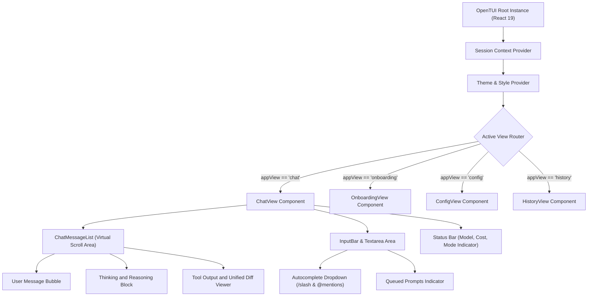

---

### Diagram 3: Keyboard Dispatch and Event State Machine

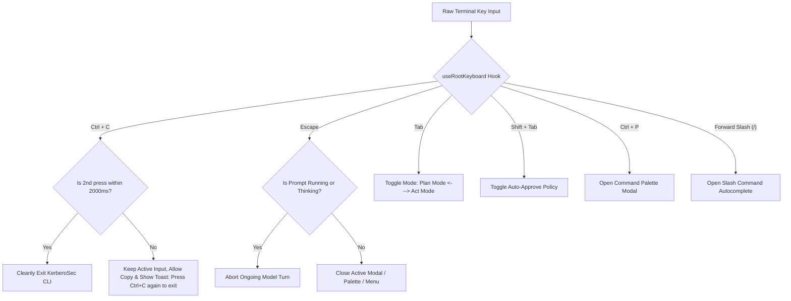

---

### Diagram 4: Interactive Turn Lifecycle and Prompt Queue

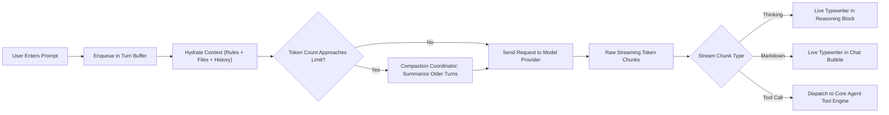

---

### Diagram 5: ReAct Decision Loop and Self-Correction Engine


---

### Diagram 6: Checkpoint Engine and Shadow Snapshot Architecture

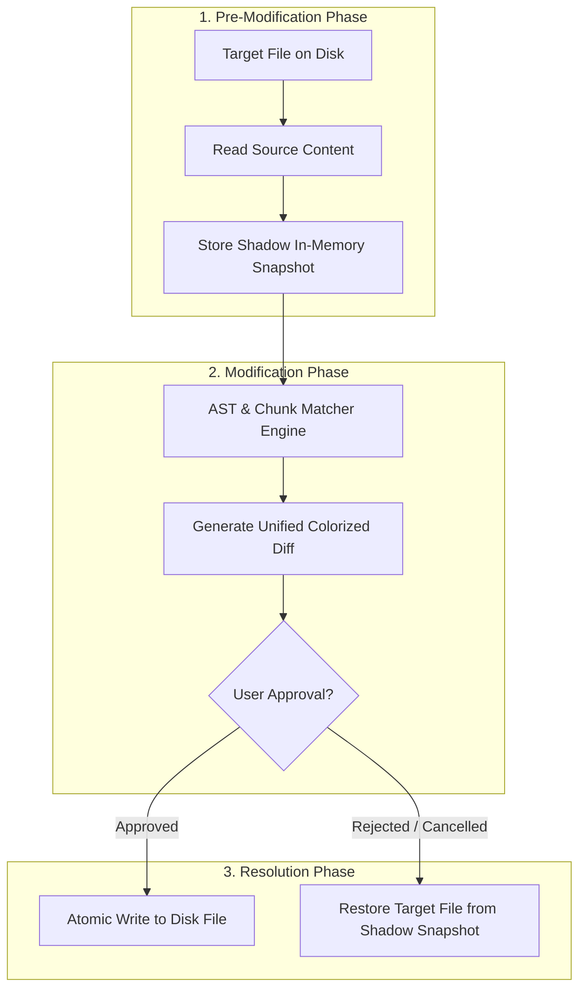

---

### Diagram 7: Chunk Diff Matching and Conflict Resolution Algorithm

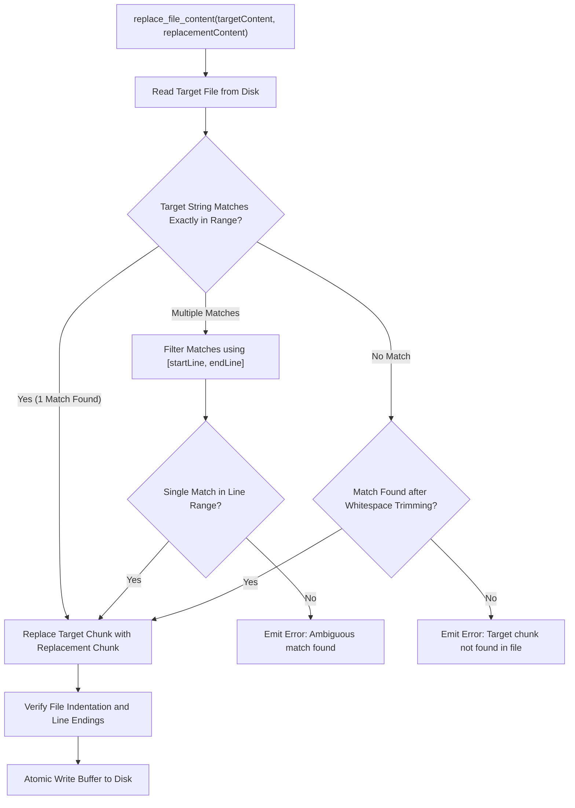

---

### Diagram 8: Multi-Provider LLM Protocol Translation Layer

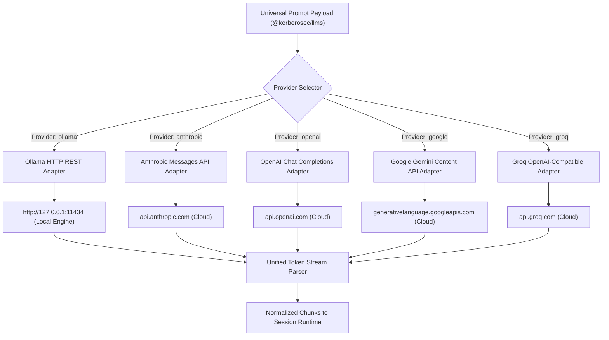

---

### Diagram 9: Local Offline Ollama Auto-Daemon Lifecycle

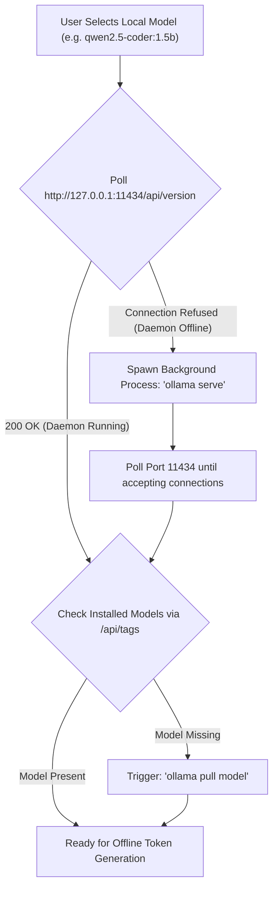

---

### Diagram 10: Model Context Protocol (MCP) Host and Tool Registry

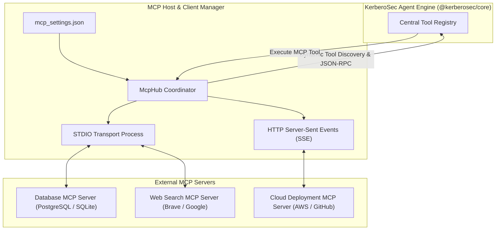

---

### Diagram 11: Concurrent Subagent Delegation Pipeline

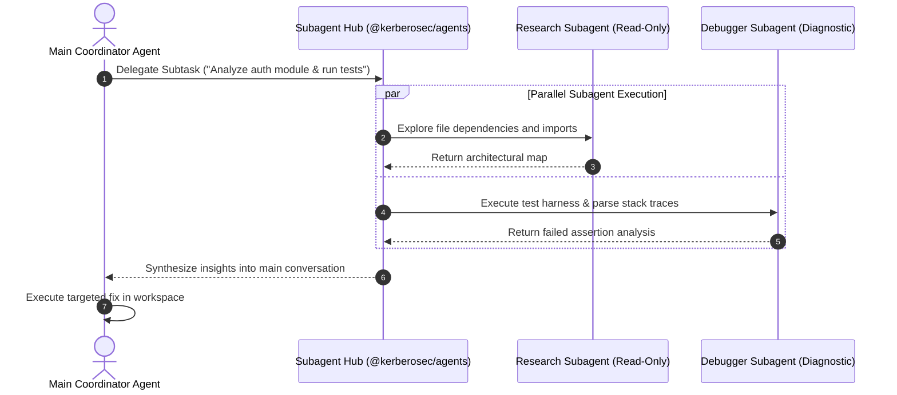

---

### Diagram 12: Context Mentions and File Pinning Engine

```mermaid
flowchart LR
    UserTypes["User Types '@' in Input Textarea"] --> Scanner["Autocomplete Context Scanner"]
    Scanner --> MatchFiles["Scan Workspace File Tree via Fast-Glob"]
    MatchFiles --> Ranker["Fuzzy Rank & Filter by Search Prefix"]
    Ranker --> DropdownUI["Render Mentions Dropdown Modal"]
    
    DropdownUI --> SelectFile["User Selects File (e.g. @src/index.ts)"]
    SelectFile --> TokenCalculator["Calculate File Token Weight"]
    TokenCalculator --> PinContext["Pin File AST and Content into Prompt Context Buffer"]
```

---

### Diagram 13: Fuzzy Command Palette and Action Dispatcher

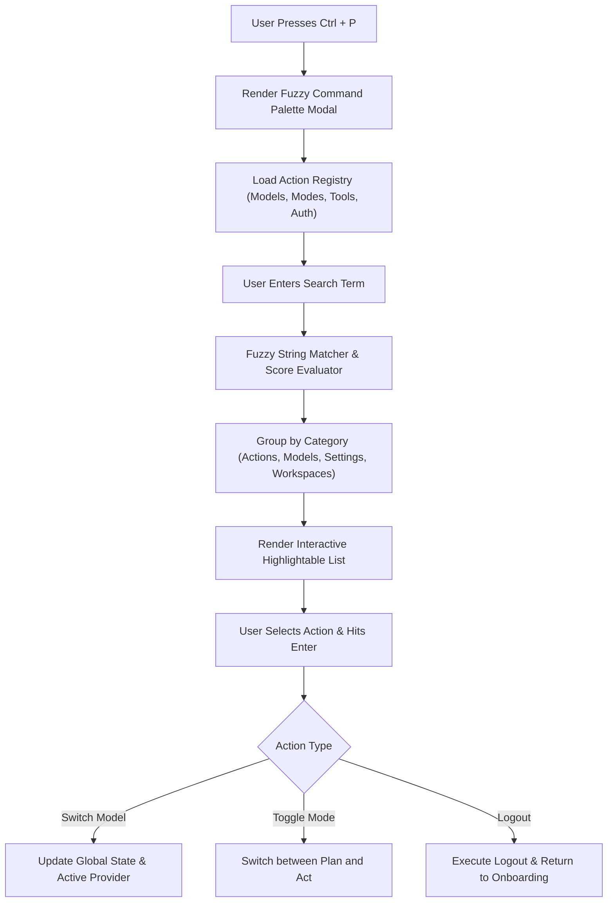

---

### Diagram 14: Subprocess Shell Runner and PTY Output Capture

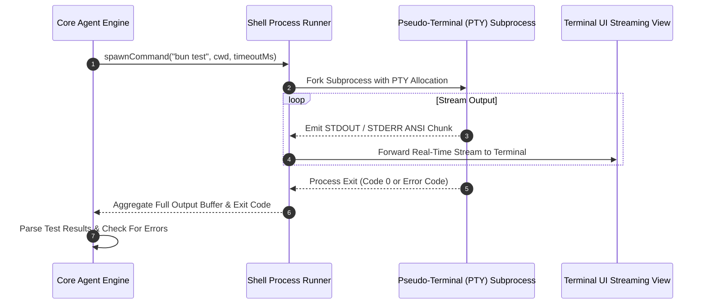

---

### Diagram 15: Session Forking and Branching Timeline Engine

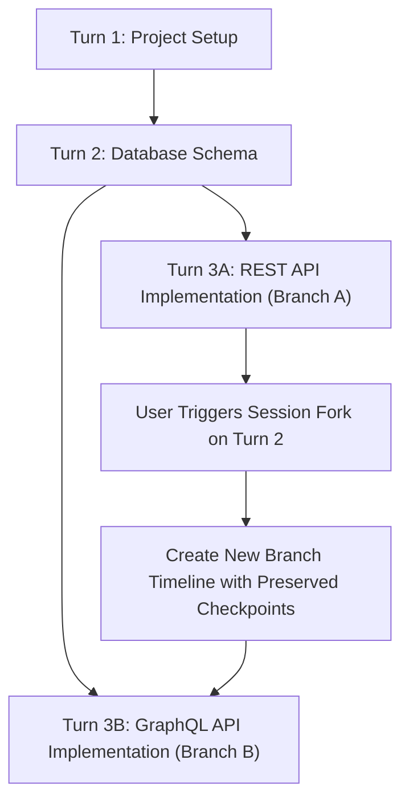

---

### Diagram 16: Git Worktree Sandbox and Workspace Isolation


---

### Diagram 17: Autonomous Routine Scheduling and Cron Engine


---

### Diagram 18: Multi-Modal Clipboard Image Processing Pipeline

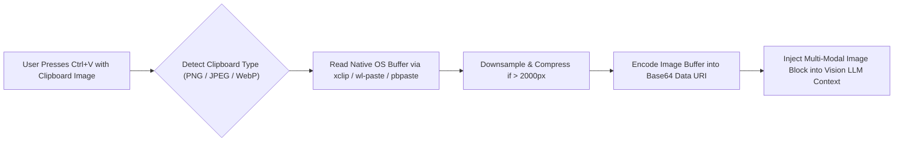

---

### Diagram 19: Mistake Detection and Self-Healing Guardrails

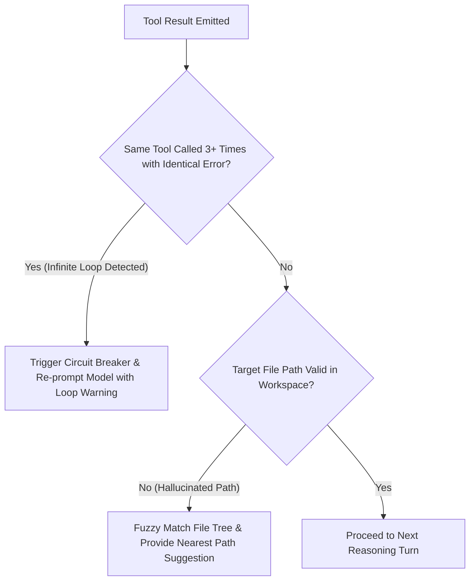

---

### Diagram 20: Real-Time Token Analytics and Cost Engine

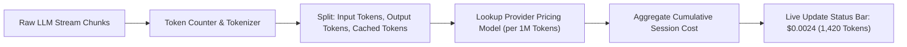

---

### Diagram 21: Authentication State Machine and Logout Flow

```mermaid
stateDiagram-v2
    [*] --> Unauthenticated: First Launch
    Unauthenticated --> Authenticating: Select Provider (Ollama / API Key)
    Authenticating --> Authenticated: Token Verified & Model Ready
    
    Authenticated --> RunningTask: User Submits Prompt
    RunningTask --> Authenticated: Task Complete
    
    Authenticated --> LoggingOut: User Types /logout or clicks Log Out
    RunningTask --> LoggingOut: User Types /logout
    
    LoggingOut --> PurgeState: Cancel Active Turn & Clear Memory Tokens
    PurgeState --> Unauthenticated: Render Onboarding View Full-Screen
```

---

### Diagram 22: Dynamic Theme Engine and ANSI Color Resolution

```mermaid
flowchart TD
    TerminalEnv["Terminal Environment (TTY / TERM / COLORTERM)"] --> DetectSupport{"Detect Color Depth Support"}
    DetectSupport -- "24-bit TrueColor" --> FullPalette["Full RGB 16.7M Color Space"]
    DetectSupport -- "256 Color" --> ANSI256["ANSI 256 Fallback Matrix"]
    DetectSupport -- "16 Color" --> Standard16["Basic ANSI 16 Colors"]

    FullPalette --> ThemeRegistry["Theme Registry (Dark, Light, Midnight, Hologram, Classic)"]
    ANSI256 --> ThemeRegistry
    Standard16 --> ThemeRegistry

    ThemeRegistry --> ResolveTokens["Resolve Semantic Tokens (Text, Border, DiffAdded, DiffRemoved)"]
    ResolveTokens --> ApplyUI["Apply Theme Contract to OpenTUI Components"]
```

---

## 🔄 Step-by-Step Execution Journey

The complete step-by-step trace of how a prompt travels through the system:

```mermaid
sequenceDiagram
    autonumber
    actor User as Developer
    participant TUI as Terminal UI (apps/cli)
    participant Runtime as Session Runtime
    participant Core as Core Engine (@kerberosec/core)
    participant LLM as Model Provider (@kerberosec/llms)
    participant Tools as Tool Executor

    User->>TUI: Submits Prompt (e.g. "fix the bug in src/index.ts")
    TUI->>Runtime: Enqueue Turn & Hydrate Context
    Runtime->>Core: Build Context Window (Rules + Files + History)
    Core->>LLM: Send Streaming Request
    
    loop Autonomous Execution Loop
        LLM-->>Core: Stream Reasoning Tokens & Tool Call (read_file)
        Core-->>TUI: Live Stream Markdown & Thinking State
        Core->>Tools: Execute read_file("src/index.ts")
        Tools-->>Core: Return File Contents
        Core->>LLM: Append Observation to Context
        LLM-->>Core: Stream Tool Call (replace_file_content)
    end

    Core->>TUI: Render Visual Diff Preview
    alt Manual Approval Mode
        User->>TUI: Confirms Diff Approval
        TUI->>Core: Permission Granted
    else Auto-Approve Enabled
        Core->>Core: Auto-Proceed
    end

    Core->>Tools: Apply Modified Content to Disk
    Core->>Tools: Run Verification Command (bun test)
    Tools-->>Core: Test Passed (Exit Code 0)
    Core-->>TUI: Render Task Complete Summary
    TUI-->>User: Display Final Output
```

---

## ⚡ Installation and Automated 1-Step Setup

### Method 1: Automated 1-Step Setup (Recommended)

```bash
git clone https://github.com/KerberoSec/KerberoSec-CLI.git
cd KerberoSec-CLI

chmod +x setup.sh
./setup.sh
```

The installer script automatically:
1. Installs system build packages (`git`, `curl`, `build-essential`).
2. Installs and configures the **Bun** runtime.
3. Installs and configures **Ollama** with recommended coding models.
4. Installs monorepo dependencies and compiles the SDK and CLI bundle.
5. Configures the global `kerberosec` executable in your `$PATH`.

---

### Method 2: Manual Installation

```bash
# 1. Install Bun
curl -fsSL https://bun.sh/install | bash
source ~/.bashrc # or source ~/.zshrc

# 2. Clone repository & install packages
git clone https://github.com/KerberoSec/KerberoSec-CLI.git
cd KerberoSec-CLI
bun install

# 3. Build SDK and CLI
bun run build:sdk
bun -F @kerberosec/cli build

# 4. Link global command
mkdir -p ~/.local/bin
cat << 'EOF' > ~/.local/bin/kerberosec
#!/usr/bin/env bash
export PATH="$HOME/.bun/bin:$PATH"
exec bun run /FULL_PATH_TO/KerberoSec-CLI/apps/cli/src/index.ts "$@"
EOF
chmod +x ~/.local/bin/kerberosec
export PATH="$HOME/.local/bin:$PATH"
```

---

## ⌨️ Commands and Keyboard Shortcuts Reference

### Slash Commands
| Command | Description |
| :--- | :--- |
| **`/logout`** | Sign out of the active account and return to login onboarding |
| **`/model`** | Open the model selector to switch between local Ollama and cloud providers |
| **`/mcp`** | Manage Model Context Protocol (MCP) servers and tools |
| **`/clear`** | Reset conversation history and start a fresh session |
| **`/help`** | Open the interactive help and documentation dialog |

### Keyboard Shortcuts
| Shortcut | Action |
| :--- | :--- |
| **<kbd>Tab</kbd>** | Toggle between **Plan** and **Act** modes |
| **<kbd>Ctrl</kbd>+<kbd>P</kbd>** | Open the Command Palette |
| **<kbd>Ctrl</kbd>+<kbd>C</kbd> (1x)** | Copy selected text / active input (never halts thinking) |
| **<kbd>Ctrl</kbd>+<kbd>C</kbd> (2x)** | Cleanly exit KerberoSec CLI |
| **<kbd>Esc</kbd>** | Cancel ongoing thinking or prompt execution |
| **<kbd>Shift</kbd>+<kbd>Tab</kbd>** | Toggle auto-approval mode for tool executions |

---

## 👤 Author and Maintainer

**Arun Kumar**
- 💼 **LinkedIn**: [arunkumar31072006](https://www.linkedin.com/in/arunkumar31072006/)
- 🐙 **GitHub**: [@KerberoSec](https://github.com/KerberoSec)
- 🐦 **X / Twitter**: [@ArunKumar310706](https://x.com/ArunKumar310706)
- 📷 **Instagram**: [@so_far_from_your_heart](https://www.instagram.com/so_far_from_your_heart/)

---

## 📄 License

This project is licensed under the **Apache 2.0 License** - see the [`LICENSE`](./LICENSE) file for details.

Copyright © 2026 **Arun Kumar (KerberoSec)**. All rights reserved.
