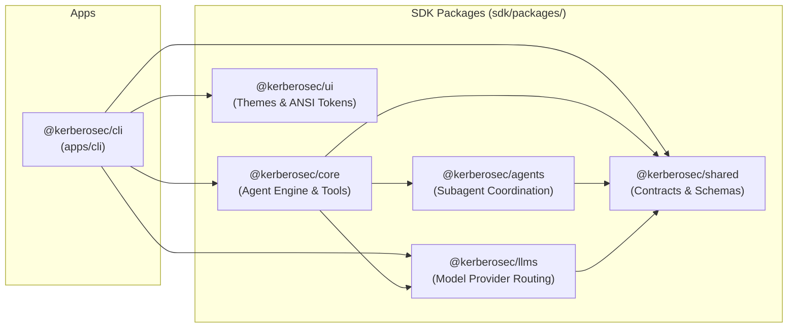
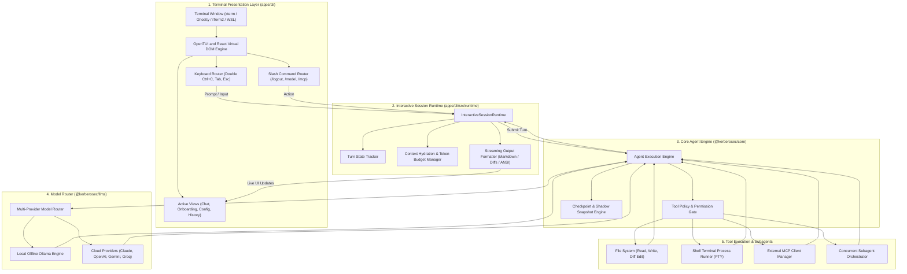
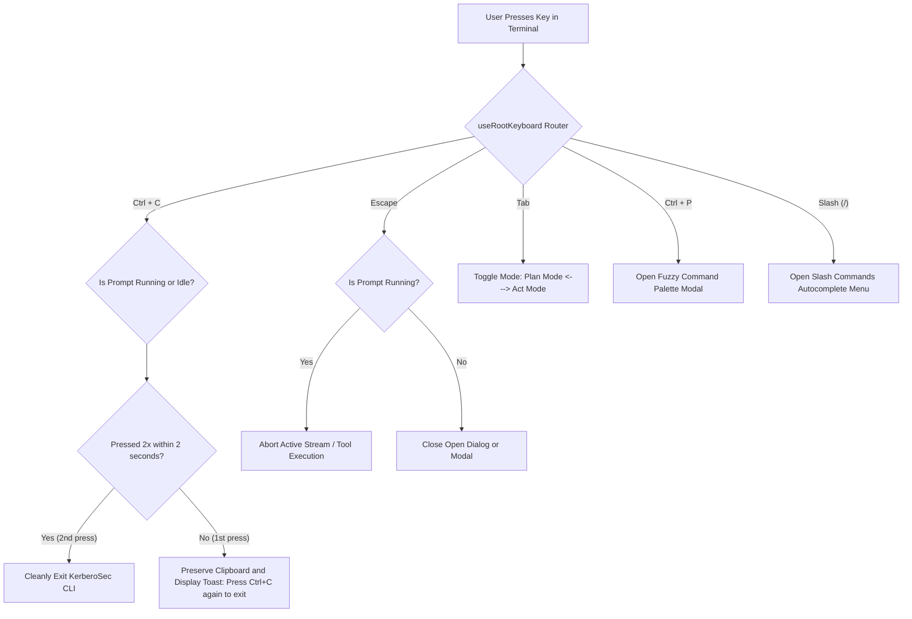
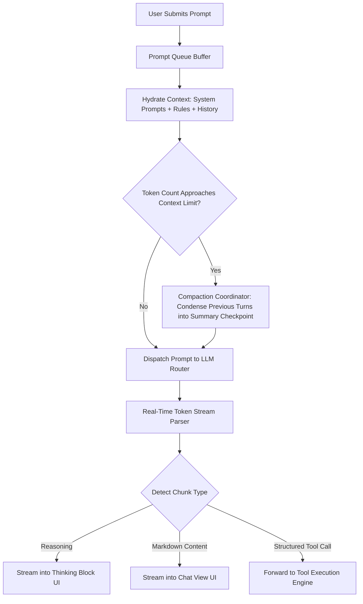
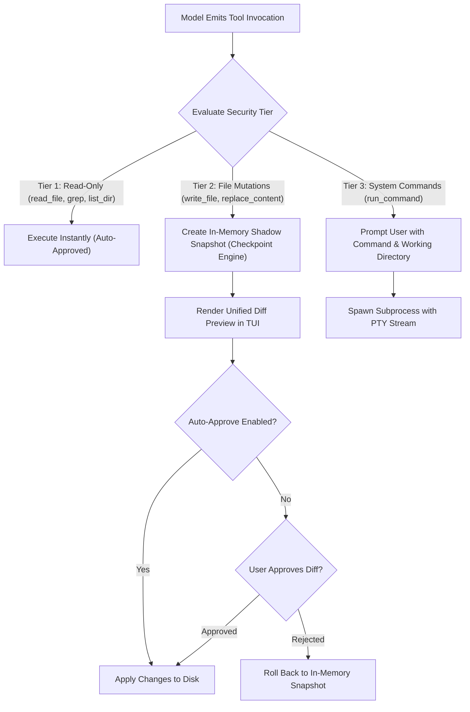
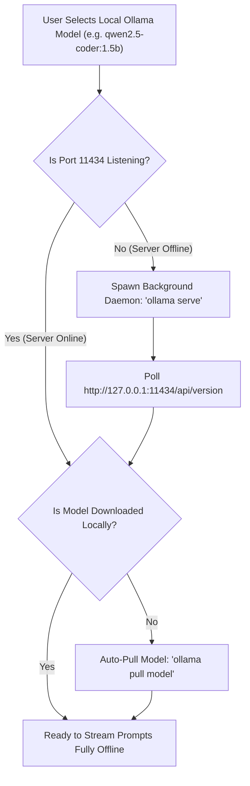
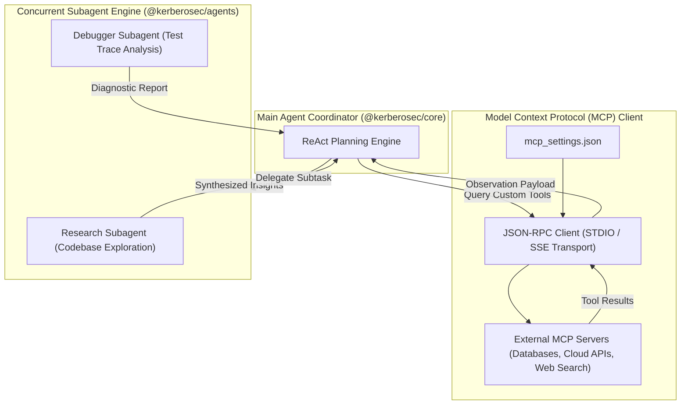
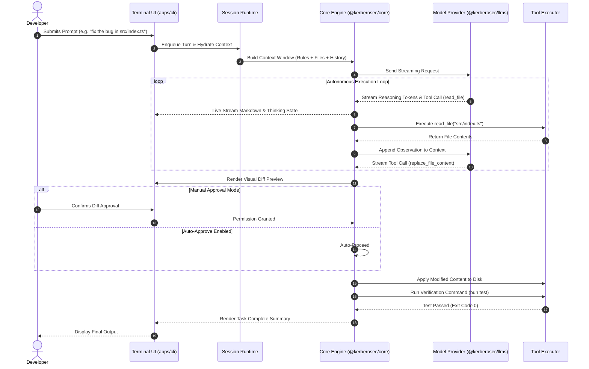

<p align="center">
  
</p>

<h1 align="center">KerberoSec CLI</h1>

<p align="center">
  <strong>Next-Generation Autonomous Agentic AI Coding Assistant for your Terminal</strong>
  <br>
  Architected, developed, and maintained by <a href="https://github.com/KerberoSec"><strong>Arun Kumar</strong></a>
</p>

<p align="center">
  <a href="https://github.com/KerberoSec/KerberoSec-CLI/blob/main/LICENSE"></a>
  <a href="https://bun.sh"></a>
  <a href="https://www.typescriptlang.org"></a>
  <a href="https://ollama.com"></a>
</p>

<div align="center">
  <table>
    <tbody>
      <tr>
        <td align="center"><a href="https://www.linkedin.com/in/arunkumar31072006/" target="_blank"><strong>💼 LinkedIn</strong></a></td>
        <td align="center"><a href="https://github.com/KerberoSec" target="_blank"><strong>🐙 GitHub</strong></a></td>
        <td align="center"><a href="https://x.com/ArunKumar310706" target="_blank"><strong>🐦 X (Twitter)</strong></a></td>
        <td align="center"><a href="https://www.instagram.com/so_far_from_your_heart/" target="_blank"><strong>📷 Instagram</strong></a></td>
        <td align="center"><a href="./Setup.md"><strong>📖 Setup Guide</strong></a></td>
      </tr>
    </tbody>
  </table>
</div>

---

## 🌟 Table of Contents
1. [Overview](#-overview)
2. [Key Highlights](#-key-highlights)
3. [Architecture and System Design](#-architecture-and-system-design)
   - [Monorepo Package Topology](#monorepo-package-topology)
   - [Diagram 1: System Layer Architecture](#diagram-1-system-layer-architecture)
   - [Diagram 2: Terminal UI and Keyboard Event Routing](#diagram-2-terminal-ui-and-keyboard-event-routing)
   - [Diagram 3: Interactive Session Runtime and Compaction Loop](#diagram-3-interactive-session-runtime-and-compaction-loop)
   - [Diagram 4: Core Agent Engine and Checkpoint Security Gate](#diagram-4-core-agent-engine-and-checkpoint-security-gate)
   - [Diagram 5: Offline Ollama Auto-Daemon Lifecycle](#diagram-5-offline-ollama-auto-daemon-lifecycle)
   - [Diagram 6: MCP Integration and Subagent Delegation](#diagram-6-mcp-integration-and-subagent-delegation)
4. [Step-by-Step Execution Journey](#-step-by-step-execution-journey)
5. [Quick Start and Automated Setup](#-quick-start-and-automated-setup)
6. [Commands and Shortcuts Reference](#-commands-and-shortcuts-reference)
7. [Author and License](#-author-and-license)

---

## 🌟 Overview

**KerberoSec CLI** is a professional terminal-native autonomous AI coding agent designed to inspect large codebases, plan multi-step technical architectures, edit files with unified diffs, execute shell commands, run diagnostics, and manage Model Context Protocol (MCP) servers.

Powered by **OpenTUI & React 19**, KerberoSec CLI combines the speed and responsiveness of native terminal tools with the reasoning capabilities of both local offline models (Ollama) and cutting-edge cloud models.

---

## 🚀 Key Highlights

- 🤖 **Offline Local AI (First-Class Ollama Integration)**:
  - Supports `qwen2.5-coder:1.5b`, `qwen2.5-coder:7b`, `llama3`, and `deepseek-coder`.
  - **Auto-Daemon Management**: Automatically detects if the background Ollama server is running on port `11434` and launches `ollama serve` seamlessly when needed.
- ☁️ **Cloud AI Providers**:
  - Out-of-the-box support for Anthropic Claude 3.7 Sonnet, OpenAI GPT-4o, Google Gemini 2.0, Groq, DeepSeek, and OpenRouter.
- ⚡ **Plan vs. Act Dual Execution Modes**:
  - **Plan Mode**: Read-only mode for codebase analysis, architecture planning, and trade-off evaluation without touching files.
  - **Act Mode**: Autonomous write mode for code generation, file replacements, and test execution.
  - Switch modes instantly with <kbd>Tab</kbd>.
- 🔐 **Account Lifecycle and Clean `/logout`**:
  - Wipe cached credentials and return to the interactive login onboarding flow with `/logout`.
- ⌨️ **Ergonomic Keyboard Bindings**:
  - **Single <kbd>Ctrl</kbd>+<kbd>C</kbd>**: Preserved for terminal copying; never kills running prompts.
  - **Double <kbd>Ctrl</kbd>+<kbd>C</kbd> (within 2s)**: Cleanly exits the CLI.
  - **<kbd>Esc</kbd>**: Aborts active reasoning or turn streaming.
  - **<kbd>Ctrl</kbd>+<kbd>P</kbd>**: Opens the fuzzy Command Palette.
- 📦 **1-Step Automated Installer (`setup.sh`)**:
  - Complete automated installer sets up Bun, Ollama, builds packages, and configures global CLI access.

---

## 🏛️ Architecture and System Design

### Monorepo Package Topology



---

### Diagram 1: System Layer Architecture



---

### Diagram 2: Terminal UI and Keyboard Event Routing



---

### Diagram 3: Interactive Session Runtime and Compaction Loop



---

### Diagram 4: Core Agent Engine and Checkpoint Security Gate



---

### Diagram 5: Offline Ollama Auto-Daemon Lifecycle



---

### Diagram 6: MCP Integration and Subagent Delegation



---

## 🔄 Step-by-Step Execution Journey

Here is the exact step-by-step trace of how a prompt travels through the system:



---

## ⚡ Quick Start and Automated Setup

### Method 1: Automated 1-Step Setup (Recommended)

```bash
git clone https://github.com/KerberoSec/KerberoSec-CLI.git
cd KerberoSec-CLI

chmod +x setup.sh
./setup.sh
```

The installer script automatically:
1. Installs system build tools (`git`, `curl`, `build-essential`).
2. Installs and configures the **Bun** runtime.
3. Installs and configures **Ollama** with recommended coding models.
4. Installs monorepo dependencies and compiles the SDK and CLI bundle.
5. Configures the global `kerberosec` executable in your `$PATH`.

---

### Method 2: Manual Installation

```bash
# 1. Install Bun
curl -fsSL https://bun.sh/install | bash
source ~/.bashrc # or source ~/.zshrc

# 2. Clone repository & install packages
git clone https://github.com/KerberoSec/KerberoSec-CLI.git
cd KerberoSec-CLI
bun install

# 3. Build SDK and CLI
bun run build:sdk
bun -F @kerberosec/cli build

# 4. Link global command
mkdir -p ~/.local/bin
cat << 'EOF' > ~/.local/bin/kerberosec
#!/usr/bin/env bash
export PATH="$HOME/.bun/bin:$PATH"
exec bun run /FULL_PATH_TO/KerberoSec-CLI/apps/cli/src/index.ts "$@"
EOF
chmod +x ~/.local/bin/kerberosec
export PATH="$HOME/.local/bin:$PATH"
```

---

## ⌨️ Commands and Shortcuts Reference

### Slash Commands
| Command | Description |
| :--- | :--- |
| **`/logout`** | Sign out of the active account and return to login onboarding |
| **`/model`** | Open the model selector to switch between local Ollama and cloud providers |
| **`/mcp`** | Manage Model Context Protocol (MCP) servers and tools |
| **`/clear`** | Reset conversation history and start a fresh session |
| **`/help`** | Open the interactive help and documentation dialog |

### Keyboard Shortcuts
| Shortcut | Action |
| :--- | :--- |
| **<kbd>Tab</kbd>** | Toggle between **Plan** and **Act** modes |
| **<kbd>Ctrl</kbd>+<kbd>P</kbd>** | Open the Command Palette |
| **<kbd>Ctrl</kbd>+<kbd>C</kbd> (1x)** | Copy selected text / active input (never halts thinking) |
| **<kbd>Ctrl</kbd>+<kbd>C</kbd> (2x)** | Cleanly exit KerberoSec CLI |
| **<kbd>Esc</kbd>** | Cancel ongoing thinking or prompt execution |
| **<kbd>Shift</kbd>+<kbd>Tab</kbd>** | Toggle auto-approval mode for tool executions |

---

## 👤 Author and Maintainer

**Arun Kumar**
- 💼 **LinkedIn**: [arunkumar31072006](https://www.linkedin.com/in/arunkumar31072006/)
- 🐙 **GitHub**: [@KerberoSec](https://github.com/KerberoSec)
- 🐦 **X / Twitter**: [@ArunKumar310706](https://x.com/ArunKumar310706)
- 📷 **Instagram**: [@so_far_from_your_heart](https://www.instagram.com/so_far_from_your_heart/)

---

## 📄 License

This project is licensed under the **Apache 2.0 License** - see the [`LICENSE`](./LICENSE) file for details.

Copyright © 2026 **Arun Kumar (KerberoSec)**. All rights reserved.
